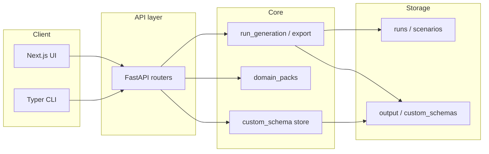

# Data Forge — Architecture Current State

This document summarizes the current repository structure, backend architecture, API surface, schema system, Custom Schema Studio, frontend routes, create flows, run lifecycle, testing, and CI workflow. Updated for release-prep.

---

## Repository Structure

```text
data-forge/
├── src/data_forge/           # Python backend
│   ├── api/                  # FastAPI app, routers, stores, middleware, security
│   ├── models/               # Schema, config, generation, manifest, rules
│   ├── engine.py             # Core run_generation, export_result (single module)
│   ├── schema_ingest/        # SQL DDL, JSON Schema, OpenAPI parsers
│   ├── rule_engine/          # YAML/JSON rule sets
│   ├── domain_packs/         # Pre-built packs (saas_billing, ecommerce, etc.)
│   ├── generators/           # Table generation, FK resolution, messiness, CDC, drift
│   ├── adapters/             # SQLite, DuckDB, Postgres, Snowflake, BigQuery load
│   ├── exporters/            # CSV, JSON, Parquet, SQL export
│   ├── simulation/           # Event streams, time patterns
│   ├── services/             # Run, scenario, retention, metrics, lineage
│   ├── storage/              # File and SQLite backends
│   ├── validators/           # Schema and data quality
│   ├── pii/                  # PII classifier and redaction
│   ├── contracts/            # Contract fixtures and validation
│   ├── warehouse_validation/ # Warehouse validation helpers
│   ├── config.py             # Settings, path validation
│   └── cli.py                # Typer CLI: generate, benchmark, validate, runs, packs
├── frontend/                 # Next.js 16 + React 19 + TypeScript
├── tests/                    # Pytest backend tests
├── frontend/e2e/             # Playwright E2E tests
├── docs/                     # Documentation
├── custom_schemas/           # User-defined schemas (JSON files)
├── scenarios/                # Scenario JSON files (file backend)
├── output/                   # Run artifacts
├── schemas/                  # Domain pack schemas
├── rules/                    # Domain pack rules
├── pyproject.toml
├── frontend/package.json
└── .github/workflows/ci.yml
```

### High-level flow



---

## Backend Architecture

### Modules Under `src/data_forge/`

| Module | Purpose |
|--------|---------|
| **api/** | FastAPI app, routers (domain_packs, generate, preflight, validate, artifacts, schema_viz, runs, benchmark, scenarios, custom_schemas), task_runner, run_store, scenario_store, custom_schema_store, schemas, security, middleware |
| **models/** | SchemaModel, config_schema (RunConfig), generation, run_manifest, rules, simulation, artifact_metadata |
| **engine.py** | `run_generation`, `export_result` — core synthetic data generation; uses row planner for cardinality |
| **generators/row_planner.py** | Row/cardinality planning; default table-name heuristics; pluggable for custom planners |
| **schema_ingest/** | `load_schema()` — SQL DDL, JSON Schema, OpenAPI; path safety |
| **rule_engine/** | YAML/JSON rule sets; `load_rule_set()` |
| **domain_packs/** | `get_pack()`, `list_packs()` — saas_billing, ecommerce, fintech_transactions, etc. |
| **generators/** | table.py, generation_rules, relationship_builder, messiness, layers, cdc_simulator, schema_drift |
| **adapters/** | base, load, registry; sqlite, duckdb, postgres, snowflake, bigquery |
| **exporters/** | CSV, JSON, Parquet, SQL |
| **simulation/** | event_stream, time_patterns |
| **services/** | run_service, scenario_service, retention_service, metrics_service, lineage_service |
| **storage/** | RunStoreInterface, ScenarioStoreInterface; file_backend, sqlite_backend |
| **validators/** | quality.py — schema and data quality |
| **pii/** | classifier, redaction |
| **contracts/** | fixtures, validate |
| **warehouse_validation/** | helpers |
| **config.py** | Settings (pydantic-settings), `ensure_path_allowed` |
| **cli.py** | Typer CLI: generate, benchmark, validate, reconcile, runs, packs |

### Storage Abstraction

- **Factory**: `get_run_store()`, `get_scenario_store()` in `storage/__init__.py`
- **Backends**: `file` (default) or `sqlite` via `DATA_FORGE_STORAGE_BACKEND`
- **File backend**: JSON in `runs/`, `scenarios/`
- **SQLite backend**: `sqlite_backend.py` with `runs` and `scenarios` tables

---

## API Surface

### Routers and Endpoints

| Prefix | Module | Key Endpoints |
|--------|--------|---------------|
| `/health` | main | `GET /health` |
| `/api/domain-packs` | domain_packs | `GET ""`, `GET /{pack_id}` |
| `/api/templates` | templates | `GET ""`, `POST /from-pack/{id}`, `POST /from-schema/{id}`, `DELETE /{id}`, `POST /{id}/unhide`, `GET /hidden` |
| `/api` | generate | `POST /generate` (sync) |
| `/api` | preflight | `POST /preflight` |
| `/api` | validate | `POST /validate`, `POST /validate/ge`, `POST /reconcile` |
| `/api/artifacts` | artifacts | `GET ""`, `GET /file?run_id=&path=` |
| `/api/schema` | schema_viz | `POST /preview`, `GET /visualize?pack_id=` |
| `/api/runs` | runs | See below |
| `/api` | benchmark | `POST /benchmark` (sync) |
| `/api/scenarios` | scenarios | See below |
| `/api/custom-schemas` | custom_schemas | See below |

### Runs (`/api/runs`)

| Method | Path | Description |
|--------|------|-------------|
| POST | `/benchmark` | Start async benchmark |
| POST | `/generate` | Start async generation |
| GET | `` | List runs (filters) |
| GET | `/metrics` | Aggregate metrics |
| GET | `/storage/summary` | Storage usage |
| GET | `/cleanup/preview` | Preview retention cleanup |
| POST | `/cleanup/execute` | Run retention cleanup |
| GET | `/compare?left=&right=` | Compare two runs |
| GET | `/{run_id}` | Run detail |
| GET | `/{run_id}/status` | Run status |
| GET | `/{run_id}/timeline` | Run timeline |
| GET | `/{run_id}/lineage` | Run lineage |
| GET | `/{run_id}/manifest` | Reproducibility manifest |
| GET | `/{run_id}/logs` | Run events |
| POST | `/{run_id}/rerun` | Rerun |
| POST | `/{run_id}/clone` | Clone config |
| POST | `/{run_id}/archive` | Archive |
| POST | `/{run_id}/unarchive` | Unarchive |
| POST | `/{run_id}/delete` | Delete |
| POST | `/{run_id}/pin` | Pin |
| POST | `/{run_id}/unpin` | Unpin |

### Scenarios (`/api/scenarios`)

| Method | Path | Description |
|--------|------|-------------|
| POST | `` | Create scenario |
| GET | `` | List scenarios |
| GET | `/{id}` | Scenario detail |
| PUT | `/{id}` | Update scenario |
| DELETE | `/{id}` | Delete scenario |
| POST | `/{id}/run` | Run from scenario |
| POST | `/from-run/{run_id}` | Create scenario from run |
| POST | `/import` | Import scenario |
| GET | `/{id}/versions` | Version history |
| GET | `/{id}/versions/{v}` | Version detail |
| GET | `/{id}/diff?left=&right=` | Diff two versions |
| GET | `/{id}/export` | Export scenario |

### Custom Schemas (`/api/custom-schemas`)

| Method | Path | Description |
|--------|------|-------------|
| POST | `/validate` | Validate schema (no save) |
| GET | `` | List schemas |
| POST | `` | Create schema |
| GET | `/{id}` | Schema detail |
| PUT | `/{id}` | Update schema |
| DELETE | `/{id}` | Delete schema |
| GET | `/{id}/versions` | List versions |
| GET | `/{id}/versions/{v}` | Version detail |
| GET | `/{id}/diff?left=&right=` | Diff versions |
| POST | `/{id}/versions/{v}/restore` | Restore a version as a **new** revision (non-destructive) |

### CORS

- Allows `http://localhost:3000`, `http://127.0.0.1:3000`

---

## Schema System

### SchemaModel (`models/schema.py`)

- **DataType**: string, text, integer, bigint, float, decimal, boolean, date, datetime, timestamp, uuid, email, phone, url, json, enum, currency, percent
- **ColumnDef**: name, data_type, nullable, unique, primary_key, default, min/max_length, min/max_value, enum_values, pattern, check, generator_hint, generation_rule (rule_type, params), description, display_name
- **TableDef**: name, columns, primary_key, unique_constraints, description, row_estimate, order, tags
- **RelationshipDef**: name, from_table, from_columns, to_table, to_columns, cardinality, optional, on_delete
- **SchemaModel**: name, description, tables, relationships, source, source_type
- **Schema validation**: `SchemaModel.validate_schema()` returns list of structural errors
- **Helpers**: `get_table()`, `get_relationships_from/to()`, `dependency_order()`

### Generation Rules (column-level)

- **rule_type**: faker, uuid, sequence, range, static, weighted_choice
- **params**: per-rule (e.g. faker provider, sequence start/step, weighted_choice choices/weights)
- **Optional param (any rule)**: `null_probability` (0 ≤ p < 1) — probability of returning `null` instead of applying the rule
- Validation via `validate_generation_rule()` in generators/generation_rules.py

### Schema Ingest

- **load_schema(path)**: .sql (DDL), .json (JSON Schema/OpenAPI), .yaml/.yml
- **Path safety**: `ensure_path_allowed()` restricts to project_root, schemas, rules, output

### Config Schema (`models/config_schema.py`)

- **RunConfig** (versioned): generation, simulation, benchmark, privacy, export, load, runtime
- **custom_schema_id**: Optional; used when schema source is custom
- **Flattening**: `to_flat_dict()`, `from_flat_dict()` for engine/API

---

## Custom Schema Registry

### Store (`api/custom_schema_store.py`)

- **Location**: `custom_schemas/schema_<id>.json`
- **Operations**: create, get, update (versioned), delete, list
- **Versioning**: MAX_VERSIONS=50; each update appends to `versions[]`
- **Validation**: All schema bodies validated via `SchemaModel.model_validate()`

### API (`routers/custom_schemas.py`)

- CRUD and version/diff endpoints as listed above
- Request body: `{ name, description?, tags?, schema }`
- Response models: CustomSchemaSummary, CustomSchemaDetail, CustomSchemaVersionsResponse

### Integration

- **Advanced Config**: Schema & Input section has Custom schema dropdown
- **Wizard**: Choose input — Domain Pack or Custom Schema; config includes custom_schema_id
- **Generate API**: Accepts custom_schema_id; loads schema from store
- **Manifest/Lineage**: custom_schema_id, custom_schema_version, schema_source_type

---

## Frontend Routes

| Route | Purpose |
|-------|---------|
| `/` | Home; first-run onboarding or recent activity |
| `/create/wizard` | Create Wizard (5 steps: Choose Input, Use Case, Realism, Export, Review) |
| `/create/advanced` | Advanced Config (tabs: Schema & Input, Rules, Generation, ETL, Simulation, etc.) |
| `/scenarios` | Scenario list |
| `/scenarios/[id]` | Scenario detail; version history & diff |
| `/runs` | Run list with badges, storage, cleanup |
| `/runs/[id]` | Run detail; lineage, manifest, timeline, artifacts |
| `/runs/compare` | Compare two runs |
| `/artifacts` | Artifact browser |
| `/templates` | Domain packs list |
| `/templates/[id]` | Pack detail; "Use This Template" → wizard |
| `/schema` | Schema Visualizer (React Flow, pack-based) |
| `/schema/studio` | Custom Schema Studio (form + JSON mode) |
| `/docs` | In-app docs with TOC |
| `/about` | About page |
| `/validate` | Validation center |
| `/integrations` | Integrations |

### Navigation

- **Main nav**: Home, Create, Scenarios, Runs, Artifacts, Docs, About
- **More dropdown**: Advanced config, Templates, Schema Studio, Schema, Validate, Integrations

---

## Create Wizard Flow

1. **Choose Input**: Domain Pack or Custom Schema (or saved scenario list)
2. **Use Case**: Presets (Demo, Unit Test, Integration Test, ETL, Load)
3. **Realism**: Scale, messiness, mode, layer
4. **Export**: Format, dbt/GE/Airflow/contracts
5. **Review & Run**: Summary, preflight (auto), Run, Save as scenario

- Uses `wizardStore` (Zustand); `customSchemaId` or `pack` in config
- Maps to flat config for `/api/runs/generate`
- Preflight runs automatically on Review step

---

## Advanced Config Flow

- Tabbed sections: Schema & Input, Rules, Generation, ETL Realism, Pipeline Simulation, Privacy, Contracts, Exports, Load, Validation, dbt/GE/Airflow, Benchmark, Raw Config
- Prefill from `?scenario=<id>` or `?clone=<json>`
- Custom schema dropdown in Schema & Input
- Preflight & Run panel; Save/Update/Save-as scenario; Import/Export JSON

---

## Run Generation Lifecycle

1. **Start**: `POST /api/runs/generate` → create run record, queue `execute_generation_async`
2. **Task runner**: Normalizes config; loads schema/rules; runs engine `run_generation`; exports; optional simulation, benchmark, load; writes manifest
3. **Stages**: preflight → schema_load → rule_load → generation → anomaly_injection → etl_transforms → export → contract_generation → warehouse_load → validation → manifest → complete
4. **Output**: `output/<run_id>/` with datasets, manifest.json, manifest.md
5. **Polling**: Frontend polls `GET /api/runs/{id}` for status

### Manifest + Lineage

- **Manifest**: `build_run_manifest()` — pack, seed, scale, mode, layer; custom_schema_id, custom_schema_version, schema_source_type (pack | custom_schema)
- **Lineage**: `get_run_lineage()` → run → scenario → version → pack (or custom_schema_id/version) → artifact_run_id
- **Manifest API**: Reads manifest.json from output dir
- **Run detail UI**: Config card, Lineage card, Reproducibility manifest card; custom schema provenance when used

### Provenance durability (deleted/missing custom schemas)

When a run uses a custom schema, the following are stored at run completion so lineage and manifest remain meaningful if the schema is later deleted:

- **Stored at completion** (in run `result_summary`): `custom_schema_name`, `custom_schema_version`, `custom_schema_snapshot_hash` (first 16 chars of SHA-256 of schema body), `custom_schema_table_names` (table names at run time).
- **Lineage/Manifest API**: When returning lineage or building manifest from record, the backend checks whether the custom schema still exists. If not, it sets `schema_missing: true` while still returning preserved id, name, version, snapshot hash, and table names.
- **UI fallback**: Run detail page (Lineage and Reproducibility manifest cards) shows a notice when `schema_missing` is true (“Custom schema no longer available (deleted or missing). Name, ID, version and snapshot are preserved for provenance.”) and displays snapshot hash and table names when present.

---

## Security Controls

- **Request logging**: Middleware logs requests
- **Request size limit**: 2MB global; 413 on exceed
- **Schema body size**: 512KB limit; validate before create/update
- **Schema ID validation**: `schema_[a-zA-Z0-9_-]{1,52}`; no path traversal
- **Path safety**: `ensure_custom_schema_path_safe`; path must stay in base_dir
- **Metadata sanitization**: name 500 chars, description 2000, tags 50 each, max 50 tags
- **Rate limiting**: In-memory per-IP limits (GET/HEAD 300/min; POST/PUT/PATCH/DELETE 60/min). Returns 429 when exceeded. Resets on restart.

---

## Testing Architecture

### Backend (pytest)

- **Location**: `tests/`
- **Examples**: test_api, test_custom_schemas, test_run_manifest_lineage, test_custom_schema_generation_rules, test_security, test_engine
- **Client**: FastAPI TestClient against `data_forge.api.main:app`
- **Run**: `uv run pytest tests -v` or `pytest tests -v`

### Frontend (Vitest)

- **Location**: `frontend/src/**/*.test.tsx`
- **Stack**: Vitest, React Testing Library, jsdom
- **Pattern**: Mock `fetch`, `next/navigation`
- **Run**: `cd frontend && npm test`

### E2E (Playwright)

- **Config**: `frontend/playwright.config.ts`; `testDir: ./e2e`
- **Tests**: `smoke.spec.ts` (basic loads) and `golden-path.spec.ts` (custom schema → validate → preview/save → wizard run → provenance)
- **Run**: `cd frontend && npm run e2e`
- **CI**: E2E job starts API + frontend; Playwright runs as a **strict gate** (no continue-on-error)

---

## CI Workflow

**File**: `.github/workflows/ci.yml`

### Backend Job

- Python 3.12
- `pip install -e ".[dev]"`
- `ruff check src tests` (strict)
- `mypy src` (strict gate)
- `pytest tests -v --tb=short` (strict)
- `pip-audit` (continue-on-error: true)

### Frontend Job

- Node 20, npm cache
- `cd frontend && npm install`
- `npx tsc --noEmit` (strict)
- `npm test` (Vitest, strict)
- `npm run build` (strict)
- `npm audit` (continue-on-error: true)

### E2E Job

- Installs backend, frontend, Playwright (chromium)
- Builds frontend
- Starts API (uvicorn) and frontend (`npm run start`)
- Waits, then `npm run e2e`
- Strict gate (fails the workflow on E2E failure)

---

## Environment and Config

- **Backend**: `DATA_FORGE_*` env vars; `.env` optional
- **Frontend**: `NEXT_PUBLIC_API_URL` or `API_BASE` (default `http://localhost:8000`)
- **Structured logs**: `DATA_FORGE_STRUCTURED_LOGS=1` emits JSON request logs (method, path, status_code, duration_ms)
