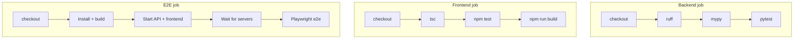

# CI/CD

This document describes the continuous integration and deployment setup for Data Forge.

## Overview

CI runs on every push and pull request to `main` and `master` via [GitHub Actions](https://github.com/features/actions). All jobs are **strict gates**: a failing step fails the workflow. There is no `continue-on-error` on quality steps (ruff, mypy, pytest, frontend typecheck, frontend tests, frontend build, or Playwright E2E).

## Pipeline diagram



All three jobs run in parallel. The E2E job installs and builds the frontend itself and starts API + frontend; it does not use the Frontend job’s build. All three must succeed for the workflow to pass.

## Workflow file

- **`.github/workflows/ci.yml`** — Single workflow with three jobs: `backend`, `frontend`, `e2e`.

## Backend job

Runs on Ubuntu with Python 3.12.

| Step | Command | Gate |
|------|---------|------|
| Ruff | `ruff check src tests` | **Strict** — must pass |
| **Mypy** | `mypy src` | **Strict** — must pass. Backend type-check; no continue-on-error. |
| Pytest | `pytest tests -v --tb=short` | **Strict** — must pass |
| Pip audit | `pip-audit --desc` | Optional — `continue-on-error: true` |

Mypy is configured in `pyproject.toml` with `strict = true` and runs over the `src` package only. Fix any type errors before pushing; CI will fail otherwise.

## Frontend job

Runs only when `frontend/package.json` exists. Node 20.

| Step | Command | Gate |
|------|---------|------|
| TypeScript | `npx tsc --noEmit` | **Strict** |
| Unit tests | `npm test` | **Strict** |
| Build | `npm run build` | **Strict** |
| NPM audit | `npm audit --audit-level=moderate` | Optional — `continue-on-error: true` |

## E2E job

Starts the API and frontend, waits until both respond (polling up to ~60s), then runs Playwright E2E. The wait step **fails** the job if the API or frontend is not ready, so E2E never runs against unavailable servers.

| Step | Command | Gate |
|------|---------|------|
| Wait for servers | Poll `GET /health` (API) and frontend root until 200 | **Strict** — must succeed |
| Playwright E2E | `cd frontend && npm run e2e` | **Strict** — must pass |

See [testing.md](testing.md) for how to run E2E locally.

## Local parity

To mirror CI locally, run:

```bash
make validate-all
# or: scripts/validate_all.ps1  (Windows)  /  scripts/validate_all.sh  (Linux/macOS)
```

This runs, in order: **ruff**, **mypy**, **pytest**, then (if `frontend/package.json` exists) frontend **tsc**, **npm test**, and **npm run build**. E2E is separate: `make e2e` or `cd frontend && npm run e2e`.

## Merge expectations

- **All three jobs (backend, frontend, e2e) must succeed** before merging. There is no bypass for failing tests or type-check.
- **Mypy** must pass on `src/`; fix type errors locally with `uv run mypy src` before pushing.
- **Playwright E2E** runs after API and frontend are up; if the wait step times out, the job fails — ensure no port conflicts and that the workflow has enough time for install/build/start.
- **Frontend job** is skipped if `frontend/package.json` is missing; the E2E job still runs if it installs the frontend itself.

## Troubleshooting

- **Backend job fails on mypy:** Run `uv run mypy src` locally; fix reported errors. Check `pyproject.toml` `[tool.mypy]` overrides if a third-party module is involved.
- **Backend job fails on pytest:** Run `uv run pytest tests -v --tb=short` locally; fix failing tests. Use `-x` to stop on first failure.
- **Frontend job fails on build:** Run `cd frontend && npm run build` locally. On some environments (e.g. OneDrive-synced folders), EPERM or file lock can cause build failure; run from a non-synced path or close other tools. Type-check and unit tests (`npx tsc --noEmit`, `npm test`) validate code even if build fails in CI.
- **E2E job fails on “Wait for servers”:** API or frontend did not respond in time. Check that no other process uses port 8000 or 3000; ensure install and build steps completed; review job logs for startup errors.
- **E2E job fails on Playwright:** Run E2E locally with API and frontend started; use `npm run e2e -- --debug` for the inspector. Check for flaky selectors or timing; see [testing.md](testing.md) for golden path coverage and debug tips.

## See also

- [testing.md](testing.md) — Test layout, commands, strict vs optional, debugging
- [api-reference.md](api-reference.md) — API endpoints and error responses
- [security.md](security.md) — Security and rate limiting
- [README](../README.md) — Setup and quick start
- [CONTRIBUTING](../CONTRIBUTING.md) — Full validation and contribution flow
