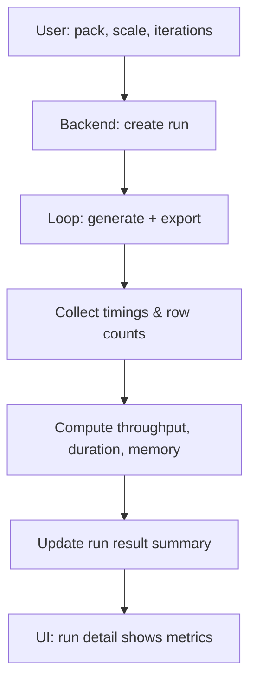

# Benchmark workflow

Benchmark runs execute N iterations of generation and export (and optionally load). Results include generation seconds, export seconds, total rows, rows/second, and memory estimate. Scale presets (small → xlarge) and workload profiles (wide_table, high_cardinality, etc.) control the effective data volume and shape.
