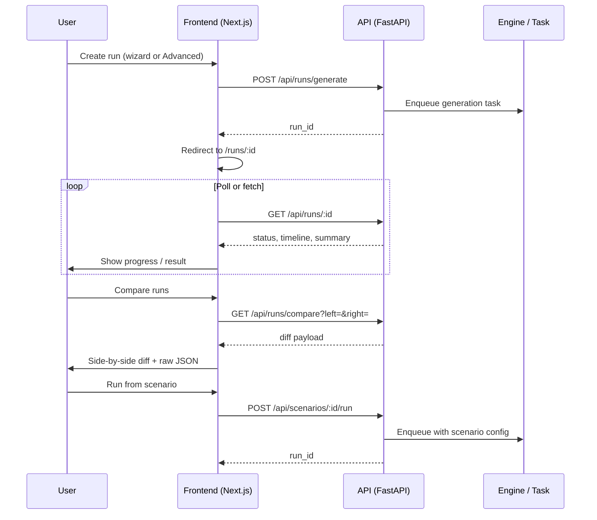

# Frontend–backend–API interaction

The frontend is stateless; all run and scenario state lives in the backend. Long-running runs are observed by polling the run endpoint until status is terminal (succeeded/failed/cancelled).
