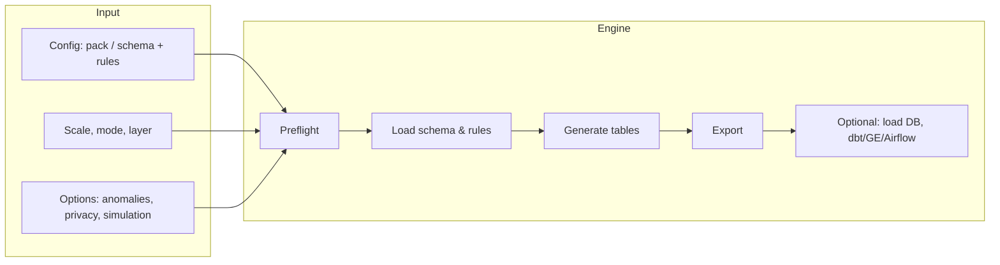

# Generation pipeline flow

Stages in order: **Preflight** (validate config) → **Load schema & rules** (from pack or files) → **Generate** (tables in dependency order, FK resolution, drift/messiness/anomalies, simulation events) → **Export** (Parquet, CSV, JSON, SQL) → **Optional** (DB load, dbt/GE/Airflow export, manifest).
