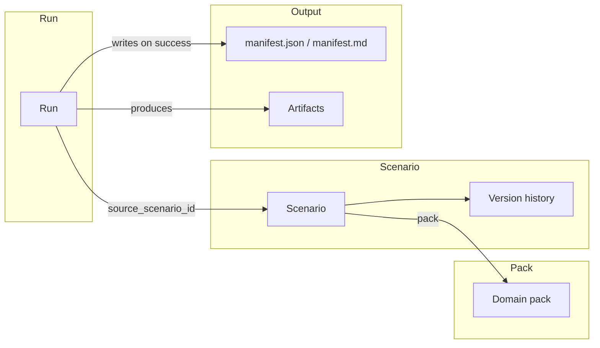

# Lineage and reproducibility manifest

- **Lineage**: Run → Scenario (optional) → Version → Pack → Artifacts. Exposed via `GET /api/runs/{id}/lineage` and shown on the run detail page.
- **Manifest**: Reproducibility snapshot (seed, config version, git SHA, platform) written to the run output dir and exposed via `GET /api/runs/{id}/manifest`. Shown on the run detail page under "Reproducibility manifest".
- **Scenario versioning**: Config changes create new versions; diff any two versions via API and the scenario detail "Version history" / "Compare versions" UI.
