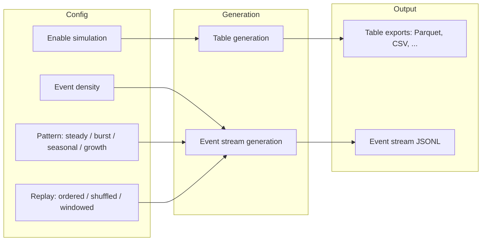

# Pipeline simulation flow

Pipeline simulation adds **event-stream** output alongside normal table data. Supported packs (e.g. ecommerce, fintech, logistics, IoT) define event types; the engine generates time-ordered events according to density and pattern. Replay mode affects how events are ordered in the output.
