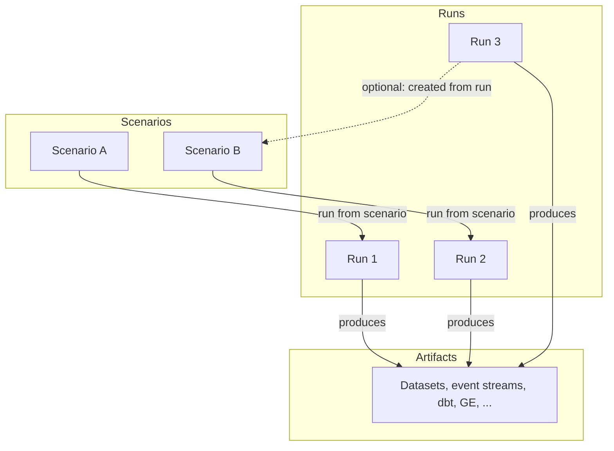

# Run, scenario, and artifact relationships

- **Scenario** = saved config (name, category, tags, config blob). Can be created from scratch, from Advanced config, or from a run (clone).
- **Run** = one execution (generate or benchmark). May have `source_scenario_id` if started from a scenario.
- **Artifacts** = output files registered per run (path, type). One run can have many artifacts.
