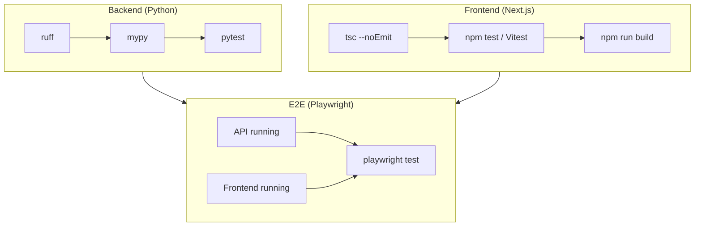

# Testing

This document describes how to run and extend tests for Data Forge (backend, frontend, and E2E). It is the **canonical reference** for test layout, commands, and CI order. See [ci-cd.md](ci-cd.md) for the CI workflow and [api-reference.md](api-reference.md) for API behavior.

## Test layers



Local full check: run Backend + Frontend (e.g. `make validate-all`), then E2E separately (`make e2e`) with API and frontend started.

## Backend (Python)

### Lint and type-check

- **Ruff:** `uv run ruff check src tests` (or `python -m ruff check src tests`)
- **Mypy:** `uv run mypy src` (or `python -m mypy src`)

Mypy is a **strict CI gate**: CI runs `mypy src` with no continue-on-error. Fix all type errors before pushing. Configuration is in `pyproject.toml` under `[tool.mypy]` (strict mode, Python 3.10 target, with overrides for some third-party and legacy modules).

### Unit / integration tests

```bash
uv run pytest tests -v --tb=short
# or: uv run pytest -q
```

**Layout:** All backend tests live under `tests/`. Examples: `test_api.py`, `test_engine.py`, `test_custom_schemas.py`, `test_run_manifest_lineage.py`, `test_provenance_durability.py`, `test_security.py`, plus milestone and integration tests. Use FastAPI `TestClient` against `data_forge.api.main:app` for API tests. CI runs the same command.

**Slow tests:** Some tests are marked `@pytest.mark.slow` (e.g. rate-limit 429 test that sends many requests). To skip them: `pytest tests -m "not slow" -v`. CI runs the full suite.

## Frontend (Next.js)

### Type-check

```bash
cd frontend && npx tsc --noEmit
```

### Unit tests (Vitest)

```bash
cd frontend && npm test
```

**Layout:** Test files sit next to components or pages (e.g. `src/app/page.test.tsx`, `src/app/schema/studio/page.test.tsx`, `src/components/PipelineFlowGraph.test.tsx`, `src/lib/utils.test.ts`). Vitest + React Testing Library; mock `fetch` and `next/navigation` where needed. See [CONTRIBUTING.md](../CONTRIBUTING.md#adding-a-frontend-test) for adding tests.

### Build

```bash
cd frontend && npm run build
```

## E2E (Playwright)

Playwright runs against a live API and frontend. Local runs auto-start both via `frontend/playwright.config.ts`. CI also starts both servers, **waits until they respond** (polling API health and frontend root), then runs E2E. E2E is a **strict CI gate**: any failure fails the workflow.

### One-time setup

```bash
cd frontend
npx playwright install --with-deps chromium   # or without --with-deps for browsers only
```

### Run E2E

```bash
cd frontend && npm run e2e
```

Or from repo root: `make e2e`.

By default, local Playwright runs start API + frontend automatically. If you already have servers running, Playwright reuses them. See `frontend/playwright.config.ts` and `frontend/e2e/` for specs.

**Layout:** E2E specs live in `frontend/e2e/`. **smoke.spec.ts** — homepage and create wizard load. **golden-path.spec.ts** — main happy path (serial): custom schema in Schema Studio → validate → save → wizard run with pack path → advanced pack path → runs index → run detail (lineage/manifest/provenance). **validation-recovery.spec.ts** — Schema Studio: validate (see feedback), fix schema (e.g. add column), re-validate, save.

**What the golden path covers:** Schema Studio create/validate/save, wizard with custom schema or pack, advanced config, run creation, runs list, run detail with lineage and manifest (including custom schema provenance). E2E is a **strict CI gate**; failures fail the workflow.

## Full validation (same as CI)

From repo root:

```bash
make validate-all
```

This runs, in order:

1. **Backend:** ruff, **mypy**, pytest  
2. **Frontend** (if present): tsc, npm test, npm run build  

E2E is not included in `validate-all`; run `make e2e` (or `cd frontend && npm run e2e`) separately.

### Final validation checklist (exact commands)

Run from repo root before release or after large changes. Same order as CI.

| Step | Command |
|------|---------|
| 1. Ruff | `uv run ruff check src tests` |
| 2. Mypy | `uv run mypy src` |
| 3. Pytest | `uv run pytest tests -v --tb=short` |
| 4. Frontend types | `cd frontend && npx tsc --noEmit` |
| 5. Frontend tests | `cd frontend && npm test -- --run` |
| 6. Frontend build | `cd frontend && npm run build` |
| 7. E2E | `cd frontend && npm run e2e` |

Or use `make validate-all` (steps 1–6) and `make e2e` (step 7) when Make is available.

See [ci-cd.md](ci-cd.md) for CI job details and strict gates.

## Debugging failures

- **Backend:** Run a single test file: `uv run pytest tests/test_security.py -v`. Use `-x` to stop on first failure. Increase verbosity with `-vv` or `--tb=long`.
- **Frontend:** Run one test file: `cd frontend && npm test -- src/app/page.test.tsx --run`. Use Vitest UI or `--reporter=verbose` if needed.
- **E2E:** Run one spec: `cd frontend && npm run e2e -- e2e/smoke.spec.ts`. Check `frontend/playwright-report/` and `frontend/test-results/` after a run. Use `--debug` for Playwright inspector.
- **CI:** Check the failing job (backend / frontend / e2e) in GitHub Actions; logs show the exact command and first failure. Local parity: run `make validate-all` then `make e2e`.

## See also

- [ci-cd.md](ci-cd.md) — CI workflow, strict gates, local parity
- [api-reference.md](api-reference.md) — API endpoints and error shapes
- [security.md](security.md) — Security tests and limits
- [README](../README.md) — Setup and validation commands
- [CONTRIBUTING](../CONTRIBUTING.md) — Full validation and contribution flow
